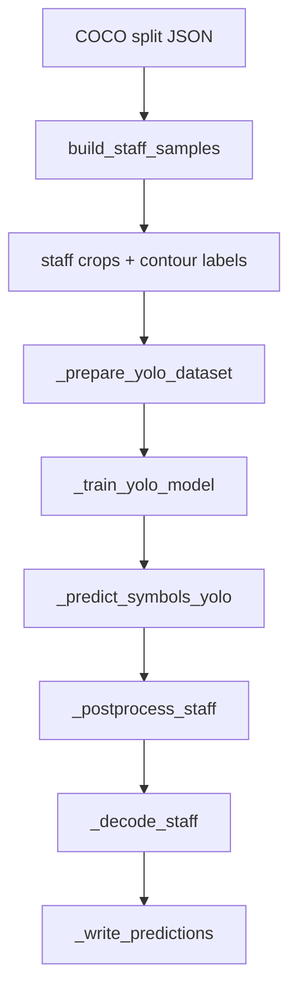

# Codebase Tour

**Mode:** scientific (`[sci]`)

**Project:** Laudare benchmark framework — Python evaluation harness for historical document layout/OCR/OMR, focused here on the BGK-OMR path.

## Technologies

- `torch` — tensor backend and GPU runtime for model execution.
- `ultralytics` — YOLO training/inference engine used as the perceptual front end.
- `numpy` — numeric aggregation for pitch-template estimation.
- `Pillow` — image IO and crop extraction for staff-level samples.
- `pyyaml` — writes YOLO dataset manifests for reproducible training.
- `matplotlib` + `seaborn` — inspect class imbalance through label-distribution plots.



## Entry point

`benchmarking/run_single_fold_benchmark.py` dynamically imports `benchmarking.train_test.train_test_bgk.train_test_bgk` when `--framework bgk --task omr` is selected. The tour below follows the internal execution of that function.
## Step 1: Experimental scope, imports, and latent variables

**File:** `benchmarking/train_test/train_test_bgk.py` lines 1–36

```
5.3%
```

@codeblock benchmarking/train_test/train_test_bgk.py 1-36

**What it does:** [sci] This header fixes the observable world of the model: staff crops are normalized to a common height, chant pitch is encoded on a seven-step alphabet, and clef/neume/delimiter categories define the sufficient statistics the rest of the pipeline tries to recover. In scientific terms, these constants operationalize the paper adaptation: they specify what information is treated as invariant across manuscripts and what information must be estimated from data.

**Coverage:**
```
files 1/1 = 100.0%
lines 36/678 = 5.3%
██░░░░░░░░░░░░░░░░░░░░░░░░░░░░░░░░░░░░░░
```

## Step 2: Core data structures

**File:** `benchmarking/train_test/train_test_bgk.py` lines 37–71

```
10.5%
```

@codeblock benchmarking/train_test/train_test_bgk.py 37-71

**What it does:** [sci] These dataclasses are the pipeline’s experimental units. `StaffSample` is the analysis sample, `SymbolAnnotation` is the annotated supervision signal, `PredictedSymbol` is the detector output, and `ClefState` carries the latent musical context needed to decode interval geometry into pitch strings. This separation matters because training is local to staff crops, while evaluation is ultimately page-level transcription.

**Coverage:**
```
files 1/1 = 100.0%
lines 71/678 = 10.5%
████░░░░░░░░░░░░░░░░░░░░░░░░░░░░░░░░░░░░
```

## Step 3: Pitch parsing and contour extraction

**File:** `benchmarking/train_test/train_test_bgk.py` lines 72–108

```
15.9%
```

@codeblock benchmarking/train_test/train_test_bgk.py 72-108

**What it does:** [sci] This block converts symbolic chant text into an ordinal pitch space, then compresses multi-note neumes into contour strings such as ascent, descent, or repetition. The theoretical purpose is dimensionality reduction: instead of memorizing every literal token sequence, the detector learns reusable melodic shape classes that can be re-instantiated later from geometric position plus clef context.

**Coverage:**
```
files 1/1 = 100.0%
lines 108/678 = 15.9%
██████░░░░░░░░░░░░░░░░░░░░░░░░░░░░░░░░░░
```

## Step 4: Label naming and ordering rules

**File:** `benchmarking/train_test/train_test_bgk.py` lines 109–140

```
20.6%
```

@codeblock benchmarking/train_test/train_test_bgk.py 109-140

**What it does:** [sci] These helpers define the taxonomy the detector will optimize against. By sorting base symbols before contour-specific neumes and collapsing labels into morphological families, the code imposes an interpretable class structure that supports later overlap pruning and analysis of error modes, especially when rare long-neume classes have low statistical power.

**Coverage:**
```
files 1/1 = 100.0%
lines 140/678 = 20.6%
████████░░░░░░░░░░░░░░░░░░░░░░░░░░░░░░░░
```

## Step 5: Annotation-to-label conversion

**File:** `benchmarking/train_test/train_test_bgk.py` lines 141–171

```
25.2%
```

@codeblock benchmarking/train_test/train_test_bgk.py 141-171

**What it does:** [sci] This is the observation model from Laudare annotations to BGK classes. It translates descriptive ground truth into a compact medieval-OMR ontology and uses bounding-box centers as the assignment statistic, implicitly assuming that staff membership is better approximated by symbol centroids than by full-box overlap for dense notation.

**Coverage:**
```
files 1/1 = 100.0%
lines 171/678 = 25.2%
██████████░░░░░░░░░░░░░░░░░░░░░░░░░░░░░░
```

## Step 6: Page → staff sample extraction: crop geometry

**File:** `benchmarking/train_test/train_test_bgk.py` lines 172–200

```
29.5%
```

@codeblock benchmarking/train_test/train_test_bgk.py 172-200

**What it does:** [sci] This first half of `build_staff_samples` turns page-level COCO annotations into per-staff training samples. The asymmetric margins are not cosmetic: the enlarged left context encodes the prior that clefs and entry symbols cluster near the staff start, which reduces truncation risk for the very symbols that anchor later pitch reconstruction.

**Coverage:**
```
files 1/1 = 100.0%
lines 200/678 = 29.5%
████████████░░░░░░░░░░░░░░░░░░░░░░░░░░░░
```

## Step 7: Page → staff sample extraction: symbol assignment

**File:** `benchmarking/train_test/train_test_bgk.py` lines 201–230

```
33.9%
```

@codeblock benchmarking/train_test/train_test_bgk.py 201-230

**What it does:** [sci] The second half collects only symbols whose centers lie inside a staff and rewrites their boxes into crop-local coordinates. This produces conditionally independent staff-level examples for the detector, a strong modeling assumption that trades global page context for cleaner supervision and higher effective sample size during training.

**Coverage:**
```
files 1/1 = 100.0%
lines 230/678 = 33.9%
██████████████░░░░░░░░░░░░░░░░░░░░░░░░░░
```

## Step 8: Label space and geometric primitives

**File:** `benchmarking/train_test/train_test_bgk.py` lines 231–269

```
39.7%
```

@codeblock benchmarking/train_test/train_test_bgk.py 231-269

**What it does:** [sci] These functions build the empirical class vocabulary from observed neume forms, load grayscale crops, and define the geometric scale relating vertical displacement to pitch steps. The key scientific move is to estimate pitch on a normalized lattice tied to staff height, making transcriptions comparable across manuscripts with different absolute resolution.

**Coverage:**
```
files 1/1 = 100.0%
lines 269/678 = 39.7%
████████████████░░░░░░░░░░░░░░░░░░░░░░░░
```

## Step 9: Neume template estimation from training data

**File:** `benchmarking/train_test/train_test_bgk.py` lines 270–299

```
44.1%
```

@codeblock benchmarking/train_test/train_test_bgk.py 270-299

**What it does:** [sci] `build_neume_templates` learns mean within-neume pitch offsets conditioned on label and clef. This is the paper’s background-knowledge core in statistical form: detector outputs identify symbol shape, while a training-set average over aligned examples supplies the expected internal interval structure for each contour class.

**Coverage:**
```
files 1/1 = 100.0%
lines 299/678 = 44.1%
██████████████████░░░░░░░░░░░░░░░░░░░░░░
```

## Step 10: Overlap model and non-max suppression logic

**File:** `benchmarking/train_test/train_test_bgk.py` lines 300–338

```
49.9%
```

@codeblock benchmarking/train_test/train_test_bgk.py 300-338

**What it does:** [sci] This block is the detector-output cleanup layer. `_normalized_overlap()` does not compare raw predicted boxes; it converts each symbol into an idealized family-specific acceptance region centered at the symbol center and scaled by `dsl`. Neumes and custos get compact square windows, delimiters get very thin horizontal windows, and clefs get much taller windows because their semantics depend on vertical extent over the staff. Two predictions are considered mutually incompatible when these normalized windows intersect.

**Why it is written this way:** [sci] Raw YOLO boxes are not reliable semantic objects here. The same medieval symbol can be boxed too wide, too narrow, or vertically shifted depending on crop context and training scarcity. The code therefore replaces detector geometry with music-aware geometry: the center is treated as the trustworthy statistic, while the allowed influence region is injected by prior knowledge. This is effectively a domain-specific NMS operating in staff units rather than pixels, so it transfers across manuscript resolutions and staff sizes.

**Code details:** [sci]
- `_label_family()` collapses many concrete labels into broad geometric families; the overlap rule works at the family level because suppression depends more on shape role than on exact contour class.
- `_normalized_overlap()` builds `(x1, y1, x2, y2)` windows around each symbol center using multipliers like `0.12×dsl` for delimiters and `1.6×dsl` vertically for clefs. The asymmetry reflects symbol morphology: delimiters are narrow separators, clefs are vertically informative anchors.
- `_remove_overlaps()` sorts by `(-confidence, x)` so high-confidence symbols are considered first, with left-to-right order as the tie-breaker. This preserves reading order when scores are equal.
- When an overlap is found, the default policy is greedy rejection of the new candidate. The single exception is `clef` versus non-clef: if a new clef overlaps a kept non-clef, the kept symbol is removed and the clef survives. This is a deliberate semantic priority rule because a wrong or missing clef corrupts every downstream pitch interpretation, whereas a wrong neume usually damages only one local token.
- The final `sorted(..., key=center_x)` restores reading order after confidence-based pruning, because decoding later assumes monotone left-to-right traversal.

**Coverage:**
```
files 1/1 = 100.0%
lines 338/678 = 49.9%
████████████████████░░░░░░░░░░░░░░░░░░░░
```

## Step 11: Delimiter-aware postprocessing

**File:** `benchmarking/train_test/train_test_bgk.py` lines 339–358

```
52.8%
```

@codeblock benchmarking/train_test/train_test_bgk.py 339-358

**What it does:** [sci] After overlap pruning, the code collapses repeated adjacent delimiters into a single token. The effect is to lower variance in a symbol type that carries structural rather than melodic information, preventing visually fragmented separators from being over-counted in downstream transcription strings.

**Coverage:**
```
files 1/1 = 100.0%
lines 358/678 = 52.8%
█████████████████████░░░░░░░░░░░░░░░░░░░
```

## Step 12: Clef and symbol decoding primitives

**File:** `benchmarking/train_test/train_test_bgk.py` lines 359–393

```
58.0%
```

@codeblock benchmarking/train_test/train_test_bgk.py 359-393

**What it does:** [sci] This block is the semantic decoder. It receives cleaned symbol hypotheses and turns them into chant tokens by combining three ingredients: symbol class, staff-relative vertical geometry, and the currently active clef. `_estimate_clef_line()` quantizes a detected clef to one of the four legal line numbers; `_symbol_anchor_value()` converts a symbol’s vertical position into a pitch index relative to that clef; `_decode_symbol_description()` then maps each family to its textual representation: `/`, `//`, `KCn`/`KFn`, a single custos pitch, or a multi-note neume string.

**Why it is written this way:** [sci] Detection alone only says “there is a neume-like blob here.” Medieval OMR needs a second stage that explains what that blob means musically. The code follows a compact causal model: clef fixes the pitch reference, vertical displacement fixes the anchor pitch, and the learned neume template fixes the internal interval pattern. This factorization is the core BGK idea in executable form: recover semantics by injecting notation knowledge after vision, instead of asking the detector to memorize full symbolic strings directly.

**Code details:** [sci]
- `_estimate_clef_line()` uses `sample.staff_box` to compute equally spaced staff-line hypotheses, then snaps the clef center to the nearest one. The returned value is clamped to `1..4`, matching the output notation contract even though the drawing grid is represented with `N_STAFF_LINES=5` positions.
- `_symbol_anchor_value()` computes a continuous pitch coordinate, not an immediate discrete label. It starts from `_clef_pitch_value(clef.description)` and adds a signed vertical offset divided by `_staff_pitch_step(sample)`. This is important because geometric evidence is continuous; discretization is postponed until token writing.
- `_decode_symbol_description()` branches by symbol family:
  - delimiters are direct string constants;
  - clefs become `KC{line}` or `KF{line}` after line estimation;
  - if no `current_clef` exists, melodic symbols return an empty string, meaning the code refuses to hallucinate pitch without reference context;
  - `custos` emits one pitch by rounding the anchor;
  - `neume_*` emits a parenthesized note list by adding the learned offsets from `neume_templates[label]` to the anchor and rounding each resulting pitch.
- The use of `neume_templates[symbol.label]` means contour classes are not decorative labels. Each class indexes a learned interval prototype, so a `neume_3_uds` and a `neume_3_dsu` can share a visual category family size yet decode to different melodic sequences.
- The repeated `round → _value_to_pitch()` pattern is where continuous geometry becomes discrete chant notation. That conversion is delayed until the latest possible point to keep the intermediate representation stable under small detector shifts.

**Coverage:**
```
files 1/1 = 100.0%
lines 393/678 = 58.0%
███████████████████████░░░░░░░░░░░░░░░░░
```

## Step 13: Staff-level sequential decoding

**File:** `benchmarking/train_test/train_test_bgk.py` lines 394–420

```
61.9%
```

@codeblock benchmarking/train_test/train_test_bgk.py 394-420

**What it does:** [sci] `_decode_staff` processes symbols left-to-right while propagating clef state. This creates a causal model over the staff: each decoded clef updates the local pitch reference for subsequent symbols, mirroring how human readers use context and making page transcription sensitive to symbol order rather than just symbol inventory.

**Coverage:**
```
files 1/1 = 100.0%
lines 420/678 = 61.9%
█████████████████████████░░░░░░░░░░░░░░░
```

## Step 14: Page-level output serialization and crop export

**File:** `benchmarking/train_test/train_test_bgk.py` lines 421–456

```
67.3%
```

@codeblock benchmarking/train_test/train_test_bgk.py 421-456

**What it does:** [sci] This section implements two boundary operations between the music model and the benchmark framework. `_write_predictions()` takes decoded per-staff texts, groups them by page stem, orders them deterministically, concatenates non-empty staff strings with spaces, and writes one `{image_stem}.pred.txt` file per page. `_save_yolo_crop()` materializes the actual detector input images by cropping each `StaffSample` from the source page, converting it to RGB, checking for degenerate geometry, and saving it under a stable `stem_staffNN.png` name.

**Why it is written this way:** [sci] The detector trains and predicts on staff crops because that is the natural local unit for chant reading, but the benchmark evaluates page-level textual outputs. Without an explicit aggregation layer, the experiment would be irreproducible: the same local predictions could map to different page strings depending on incidental iteration order or missing empty pages. Likewise, detector dataset construction must serialize crops with stable names so image files, label files, and later predictions all refer to the same latent sample identity.

**Code details:** [sci]
- `_write_predictions()` first builds `ordered_stems` from `expected_stems`, then appends any extra keys found in `texts`. This matters because the benchmark expects every requested page stem to exist, including pages with empty predictions; the function therefore preserves the external evaluation contract before considering opportunistic extra outputs.
- Staff texts are stored as `Dict[str, Dict[int, str]]`, i.e. page stem → staff index → decoded string. The inner `sorted(staff_texts.items())` is crucial: it reconstructs the reading order by numeric staff index rather than by hash/dictionary insertion order.
- `value.strip()` filtering drops blank or whitespace-only staff outputs. That prevents undecodable staves from injecting spurious separators into page text.
- `_save_yolo_crop()` does not trust the source data blindly. It verifies that the source page image exists, performs the crop through `_load_crop(sample)` so crop logic stays centralized, converts to RGB because YOLO expects color images, and raises on zero-width/zero-height crops. This turns annotation/crop errors into explicit failures during dataset materialization instead of silent bad training data.
- The file name pattern `f"{sample.image_stem}_staff{sample.staff_index:02d}.png"` is an identity scheme: it ties crop export, YOLO label export, dataset split mappings, and test-time lookup back to the same sample without separate manifest files.

**Coverage:**
```
files 1/1 = 100.0%
lines 456/678 = 67.3%
███████████████████████████░░░░░░░░░░░░░
```

## Step 15: YOLO supervision targets

**File:** `benchmarking/train_test/train_test_bgk.py` lines 457–481

```
70.9%
```

@codeblock benchmarking/train_test/train_test_bgk.py 457-481

**What it does:** [sci] `_write_yolo_label()` converts each crop-local `SymbolAnnotation` into one YOLO row: `class_id center_x center_y width height`, all normalized to `[0,1]` with respect to the saved crop. It iterates over the staff symbols, discards labels outside the active vocabulary, clips every box to the crop boundaries, rejects empty boxes, computes normalized center/size values, and writes the result into the paired `stem_staffNN.txt` file.

**Why it is written this way:** [sci] YOLO training requires a very specific supervision geometry: every object must be expressed relative to the image actually seen by the detector, not the original page. Because BGK first remaps page annotations into crop-local coordinates, this function is the final consistency checkpoint that turns symbolic staff annotations into detector-ready labels. The clipping and degeneracy checks are especially important in manuscript data, where imperfect staff assignment or edge-touching symbols can otherwise produce negative widths, out-of-range centers, or zero-area targets that poison optimization.

**Code details:** [sci]
- `max_width = max(width, 1)` and the analogous height guard prevent division by zero if a malformed crop somehow reaches this stage. The code still prefers to fail earlier, but this keeps normalization numerically defined.
- For each symbol, `(x, y, w, h)` is converted into clipped corners `(x1, y1, x2, y2)` using nested `min(max(...))` bounds. This is not cosmetic: crop-local boxes may partially lie outside the crop after upstream assignment, especially near staff borders.
- `if x2 <= x1 or y2 <= y1: continue` removes degenerate boxes after clipping. Such boxes would correspond to zero visible support in the crop and should not become training targets.
- `cx`, `cy`, `nw`, `nh` are then computed in the exact format YOLO expects: normalized center coordinates and normalized size. The representation is translation- and scale-relative to the crop, which lets one model train over heterogeneous manuscript resolutions.
- The output row uses `label_to_index[symbol.label]`, so detector classes are not hard-coded. The class space is data-driven from `build_label_space()`, enabling the same export logic to support whatever contour-aware neume inventory the current split actually contains.
- Writing one `.txt` per crop with the same basename as the image file is what allows Ultralytics’ standard dataset loader to work without extra adapters.

**Coverage:**
```
files 1/1 = 100.0%
lines 481/678 = 70.9%
████████████████████████████░░░░░░░░░░░░
```

## Step 16: Exploratory class-balance diagnostics

**File:** `benchmarking/train_test/train_test_bgk.py` lines 482–518

```
76.4%
```

@codeblock benchmarking/train_test/train_test_bgk.py 482-518

**What it does:** [sci] This section quantifies label prevalence and parallelizes crop/label materialization for one split. The plot is more than bookkeeping: for contour-aware OMR, severe long-tail imbalance changes effective power across neume classes, so visualizing counts is a direct check on whether later metric shifts are plausibly data-limited rather than architecture-limited.

**Coverage:**
```
files 1/1 = 100.0%
lines 518/678 = 76.4%
███████████████████████████████░░░░░░░░░
```

## Step 17: YOLO dataset assembly and cache determinism

**File:** `benchmarking/train_test/train_test_bgk.py` lines 519–557

```
82.2%
```

@codeblock benchmarking/train_test/train_test_bgk.py 519-557

**What it does:** [sci] `_prepare_yolo_dataset` freezes train, validation, and test splits into a cached detector dataset keyed by the dataset signature. This supports reproducible experimentation by making the exact supervision state recoverable, an important safeguard when manuscript benchmarks are small and sensitive to even minor split drift.

**Coverage:**
```
files 1/1 = 100.0%
lines 557/678 = 82.2%
█████████████████████████████████░░░░░░░
```

## Step 18: YOLO training wrapper

**File:** `benchmarking/train_test/train_test_bgk.py` lines 558–591

```
87.2%
```

@codeblock benchmarking/train_test/train_test_bgk.py 558-591

**What it does:** [sci] `_train_yolo_model` is the estimation stage for symbol detection. It binds the adapted BGK task to a generic detector with fixed image size, patience, batch size, and learning rate, effectively treating YOLO as the low-level perceptual front end while leaving musical structure to later symbolic decoding.

**Coverage:**
```
files 1/1 = 100.0%
lines 591/678 = 87.2%
███████████████████████████████████░░░░░
```

## Step 19: Detector output → symbol hypotheses

**File:** `benchmarking/train_test/train_test_bgk.py` lines 592–624

```
92.0%
```

@codeblock benchmarking/train_test/train_test_bgk.py 592-624

**What it does:** [sci] This inference block transforms raw boxes into typed symbol hypotheses without extra fallback logic. The low confidence threshold maximizes recall at the detection stage, consistent with a pipeline design where musical postprocessing is expected to filter some false positives more safely than missing a clef or neume can be recovered later.

**Coverage:**
```
files 1/1 = 100.0%
lines 624/678 = 92.0%
█████████████████████████████████████░░░
```

## Step 20: Benchmark entrypoint: data assembly and training

**File:** `benchmarking/train_test/train_test_bgk.py` lines 625–651

```
96.0%
```

@codeblock benchmarking/train_test/train_test_bgk.py 625-651

**What it does:** [sci] The first half of `train_test_bgk` is the experiment orchestrator: it resolves dataset roots, enforces the presence of train/validation annotations, constructs staff samples, builds the observed label space, and trains the detector. In study-design terms, this is where the manuscript split becomes a measurable learning problem with a fixed supervision schema.

**Coverage:**
```
files 1/1 = 100.0%
lines 651/678 = 96.0%
██████████████████████████████████████░░
```

## Step 21: Benchmark entrypoint: test-time decoding and writing

**File:** `benchmarking/train_test/train_test_bgk.py` lines 652–678

```
100.0%
```

@codeblock benchmarking/train_test/train_test_bgk.py 652-678

**What it does:** [sci] The final block runs staff-level detection on the test set, carries clef state across staves within a page, decodes symbols into chant text, and writes benchmark-format predictions. This is the scientific endpoint of the BGK adaptation: local visual detections are converted into page-level symbolic sequences that can be compared directly with ground truth through CER/NER-style evaluation.

**Coverage:**
```
files 1/1 = 100.0%
lines 678/678 = 100.0%
████████████████████████████████████████
```

